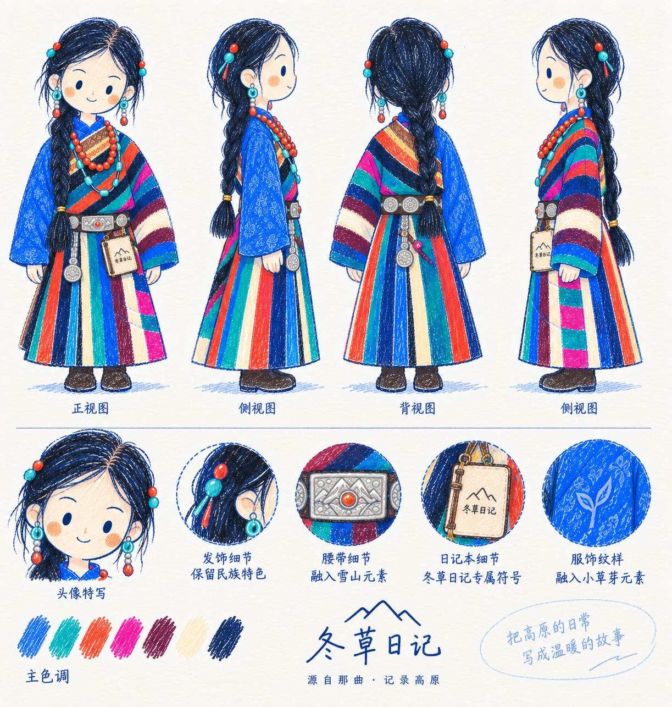
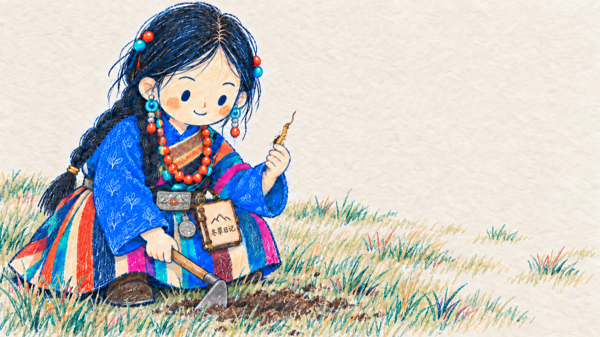
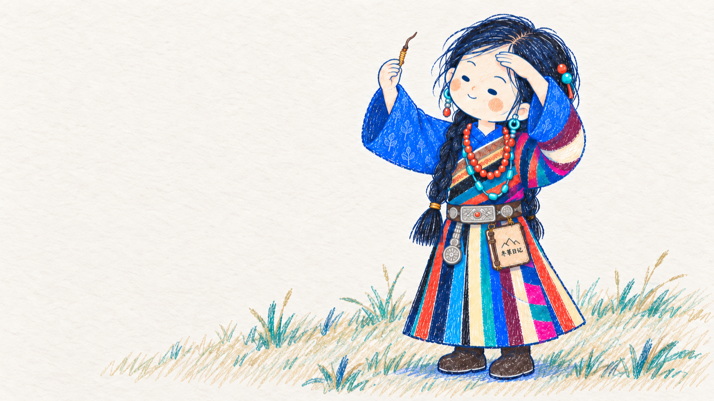
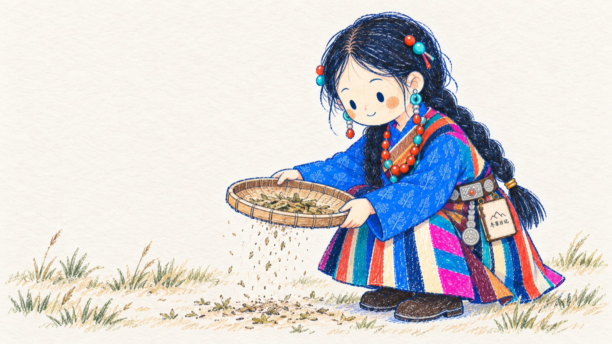
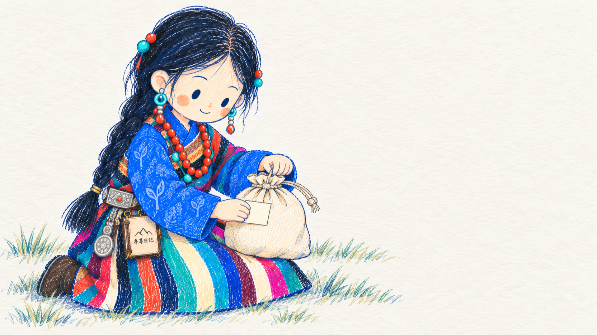
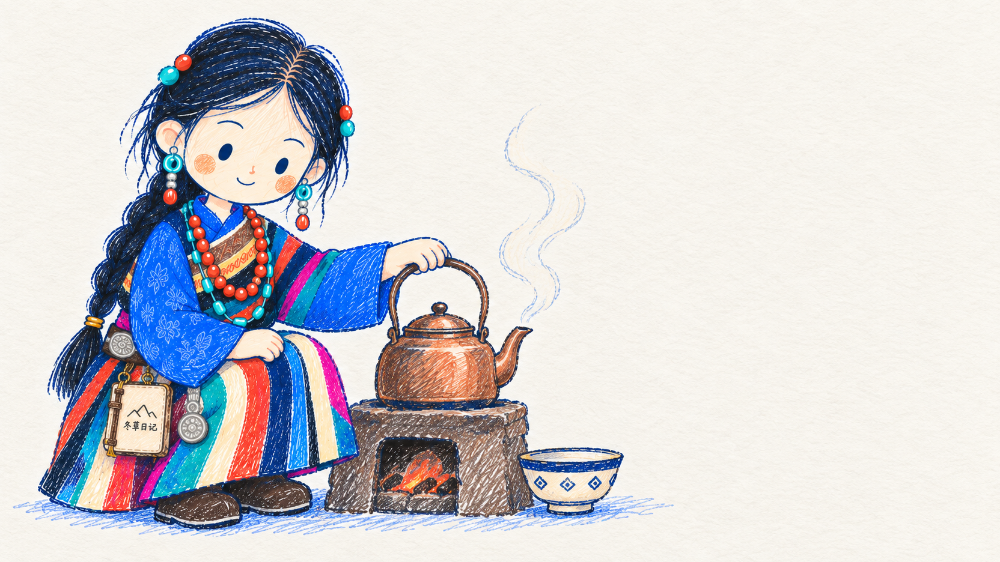
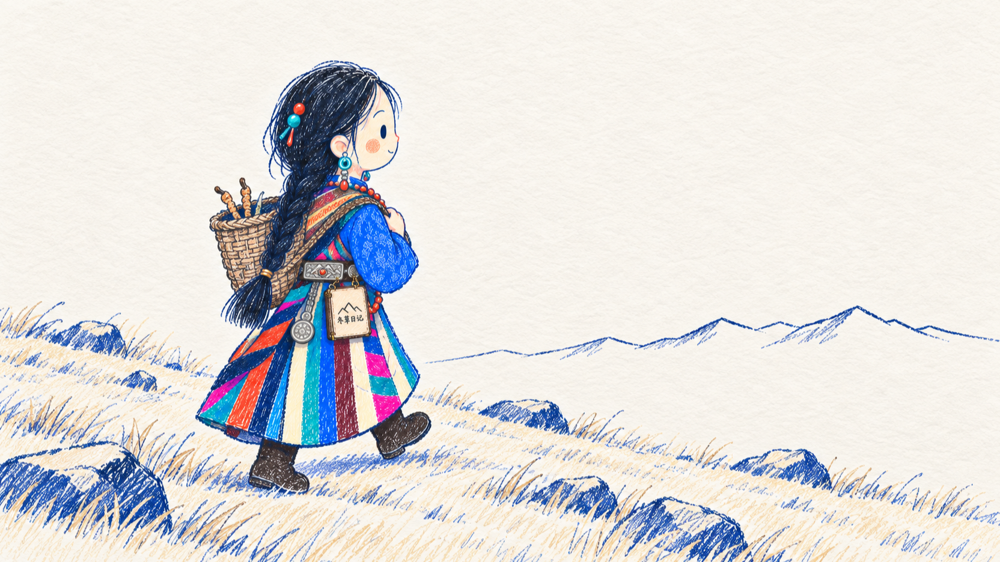

# 冬草日记 彩铅配图 Skill

> 把内容里的一个瞬间，画成一页彩色铅笔的绘本插图。
>
> 彩铅排线 | 米白纸底 | 深靛蓝勾边 | 七色藏地色板 | 冬草 IP | Codex / Claude Skill

---

## 这个仓库是什么

一个给 AI Agent 用的配图 Skill，指导它为中文文章、公众号推文、小红书图文和朋友圈生成统一风格的插画。

默认视觉 IP 是「冬草」：那曲的藏族女孩，深靛蓝辫子、彩色竖条纹裙、红珊瑚项链，腰上永远挂着那本《冬草日记》。她不是吉祥物，是画面里正在做事的那个人——挖草、筛草、装袋、寄货、晚上写日记。

**这套风格的成败九成在媒介上。** 所有颜色都是彩色铅笔斜着一层层排出来的，能看见笔道和纸的颗粒；线稿用深靛蓝色铅笔，不是黑色。一旦变成平涂或渐变，整张图立刻变回普通 AI 插画。

---

## 适合谁用

适合：

- 做虫草、滋补、高原、产地类内容，需要一套自己的配图语言的人
- 写公众号长文，想要每篇配图都像同一个人画的
- 不想用图库，也不想每次重新调 prompt 的人
- 用 Codex / Claude 做内容生产，希望稳定复用一套视觉风格的人

不适合：

- 想要商业插画、品牌 KV、精致扁平插画的人
- 想要 PPT 信息图、流程图、架构图的人
- 想要动漫、二次元、3D、盲盒风的人
- 需要可编辑矢量源文件的人

---

## 它会产出什么

- 一篇内容的 3-6 张 shot list：每张写清楚放哪段后、主题、核心意思、结构类型、冬草在做什么
- 最终 PNG，保存到 `assets/<文章名>-配图/`
- 常用比例：公众号正文 16:9、首图和小红书 3:4、朋友圈 1:1

不输出 PPTX / PDF / SVG / 可编辑矢量图。

---

## 角色基准



三视图是唯一权威的形象依据。生图时**把它一起附给模型**，脸和比例对不上时以它为准，不以过往生成图为准。

---

## 示例效果

全部 16:9，1664×936。

| | |
| --- | --- |
|  |  |
| 蹲在草甸上挖草 | 举起一根对着光看 |
|  |  |
| 竹筛筛草 | 码进铺了棉纸的木盒 |
|  |  |
| 扎紧袋口贴标签 | 炉子边烧水 |
|  |  |
| 背草篓走碎石坡 | 灯下写日记 |

示例图只用于校准笔触密度、留白和色彩克制，**不是构图模板**。使用时应该从当前内容重新想画面，不要照抄旧案例的场景和姿势。

---

## 安装

克隆仓库：

```bash
gh repo clone 3mberz/dongcao-illustrations
cd dongcao-illustrations
```

复制 skill 到通用 skill 目录（Codex 原生读取，Claude 通过软链读取同一份）：

```bash
mkdir -p ~/.agents/skills
cp -R ./dongcao-illustrations ~/.agents/skills/
```

如果只在某个项目里用，放项目内：

```bash
cp -R ./dongcao-illustrations <项目>/.agents/skills/
```

同一个 skill 只保留一份真实目录，不要同时装在两处。

---

## 怎么用

### 只做配图规划

```text
Use $dongcao-illustrations 先不要生图。
分析下面这篇内容哪里值得配图，输出 4 张左右的 shot list。
每张写清楚：放哪段后、主题、核心意思、结构类型、冬草在做什么、建议标注词。

<粘贴内容>
```

### 直接生成

```text
Use $dongcao-illustrations 把下面这篇内容生成 4 张配图。
16:9，彩铅排线、米白纸底、深靛蓝线稿，三件识别物都要在。

<粘贴内容>
```

### 单个主题一张图

```text
Use $dongcao-illustrations 为「好草和次草，摊在手心里一比就知道」生成一张配图。
冬草要真的在做这个动作，不是站在旁边。
```

### 修图

```text
Use $dongcao-illustrations 这张图变成平涂了，帮我改回彩铅排线，线稿换成深靛蓝。
```

更多示例见 [examples/prompts.md](examples/prompts.md)。

---

## 目录结构

```text
.
├── README.md
├── LICENSE
├── NOTICE.md
├── examples/
│   └── prompts.md
└── dongcao-illustrations/
    ├── SKILL.md
    ├── agents/
    │   └── openai.yaml
    ├── assets/
    │   ├── reference/          # 角色三视图，形象基准
    │   └── examples/           # 风格样例
    └── references/
        ├── style-dna.md        # 媒介、色板、禁忌
        ├── dongcao-ip.md       # 角色定义
        ├── composition-patterns.md
        ├── prompt-template.md
        └── qa-checklist.md
```

需要安装的是子目录 `dongcao-illustrations/`。根目录的 README、LICENSE、NOTICE 和 examples 是 GitHub 分享文档。

---

## 注意事项

- 生图时一定附上角色三视图，模型看图比看字准。
- 图里的中文越短越稳定，能不写字就不写字。
- 一张图只画一个瞬间。
- 冬草必须在做事；如果去掉她画面仍然成立，说明她太装饰了。
- AI 会出现错字、风格漂移、多余水印，生成后按 `qa-checklist.md` 检查。
- 最容易垮的是媒介：发现图"一眼 AI"，先回去看排线和纸底，不是看构图。

---

## 致谢

本仓库改写自 [Ian (伊恩)](https://github.com/helloianneo) 的开源项目 [ian-xiaohei-illustrations](https://github.com/helloianneo/ian-xiaohei-illustrations)，沿用了它的 skill 结构和工作流设计，视觉风格与 IP 全部替换为《冬草日记》。

改写方法参考了 [@SjwEsther](https://x.com/SjwEsther) 分享的「在开源 Skill 基础上定制自己 IP 配图」的八步流程。

感谢两位的开源和分享。

---

## License

MIT License. See [LICENSE](LICENSE).
